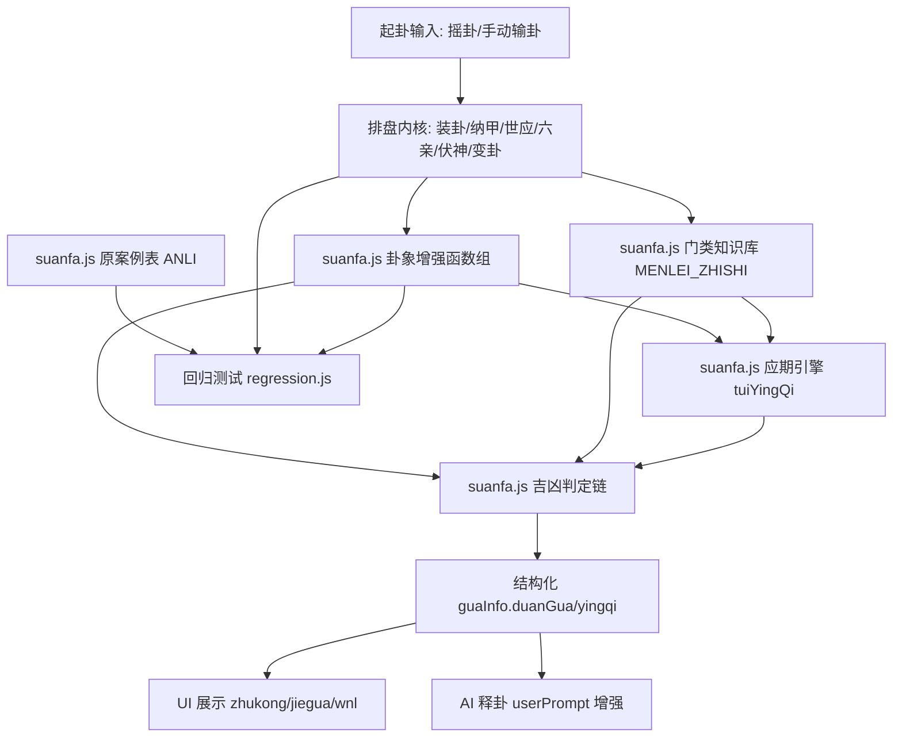

# Design Document

Feature Name: duan-gua-system-completion
Updated: 2026-08-10

## Description

以《增删卜易》为宗，对 jygldj/zsby 六爻占卜系统实施七组完善。目标：将断卦法度（六冲六合/生旺墓绝/进退/反伏/回头生克/独发独静）补为确定性计算；新增可解释的吉凶判定依据链与应期引擎；建立 12 门类知识库；将全部计算结果并入 AI 提示词（AI 只解读、不计算）；建立原案例回归测试守护内核。同时修复审查确认的四项既有缺陷（XSS、手动输卦日辰不一致、婚姻用神不分性别、两现取舍缺旺衰）。

本设计完全沿用项目现状：纯前端静态页 + 全局脚本（无构建、无模块化）。经决策，全部新增逻辑（卦象增强函数组、应期引擎、门类知识库、原案例表）并入现有 `ly/suanfa.js`，以顶层常量/全局函数形式挂载，脚本加载顺序保持不变：`lunar.js → shuju.js → suanfa.js → zhukong.js`。

## Architecture



数据流：起卦 → 装卦（不变）→ 卦象增强（纯计算，新增函数组）→ 用神按门类+性别定（改造 `xuanYongShen`）→ 断卦依据链（新增）→ 应期候选（新增）→ 统一写入 `guaInfo` → UI 展示与 AI 引用同一数据源。以上新增环节均位于 `ly/suanfa.js`。

## Components and Interfaces

### 卦象增强函数组（并入 `ly/suanfa.js`）

风格与现有代码一致：顶层常量 + 全局函数，输入 `guaInfo` 就地扩展，返回同一对象。统一入口：

```js
function suanQuanBuGuaXiang(guaInfo) {   // 汇总入口，一次补齐 R1-1 ~ R1-8
    suanLiuChongLiuHe(guaInfo);
    suanShengWangMuJue(guaInfo);
    suanHuiTou(guaInfo);
    suanFanYinFuYin(guaInfo);
    suanSanHeSanXing(guaInfo);
    suanDongSan(guaInfo);
    suanDuFa(guaInfo);
    suanTaiSui(guaInfo);
    suanNaYin(guaInfo);
    return guaInfo;
}
```

| 函数 | 责任 | 依赖 |
|---|---|---|
| `suanLiuChongLiuHe(guaInfo)` | 六爻地支两两冲/合，标注 `guaXiang.liuChong/liuHe` | `DIZHI_LIU_CHONG`(suanfa.js:377)，新增 `DIZHI_LIU_HE` 表 |
| `suanShengWangMuJue(guaInfo)` | 按五行长生表求每爻十二宫，标注 `ruMu/linJue` | 新增 `CHANG_SHENG_TABLE = {金:'巳',木:'亥',水:'申',土:'申',火:'寅'}` |
| `suanHuiTou(guaInfo)` | 动爻化出之爻对本爻生克，标注 `化进神/化退神/回头生/回头克/化墓/化绝/化空/化破` | 动爻的变爻地支（`guaData` 已有）、`DIZHI_WUXING` |
| `suanFanYinFuYin(guaInfo)` | 本卦 vs 变卦六爻地支逐一相冲→反吟、逐一相同→伏吟 | 变卦六亲/地支（`paiPanBianGua` 产物） |
| `suanSanHeSanXing(guaInfo)` | 月日动爻合局（申子辰/寅午戌/巳酉丑/亥卯未），标注所在爻 `sanHe` 与缺爻；三刑（寅巳申/丑戌未/子卯/辰午酉亥自刑）标注 `xing` | `timeInfo`、动爻集 |
| `suanDongSan(guaInfo)` | 动爻被日支冲→`dongSan=true`（动散） | `timeInfo.riChen`、动爻集 |
| `suanDuFa(guaInfo)` | 动爻计数→`duFa ∈ {独发,六爻安静,多动}`，独发时记录爻位 | 动爻集 |
| `suanTaiSui(guaInfo, opts)` | 年支生克与岁破 `nianPo`；默认不改变既有评分 | `timeInfo.nianGanZhi` |
| `suanNaYin(guaInfo)` | 六十甲子纳音标注每爻 | 新增 `NA_YIN_60` 表 |

### 应期引擎（并入 `ly/suanfa.js`）

```js
function tuiYingQi(guaInfo, startDate)   // startDate 默认当日，返回 guaInfo.yingqi
```

扫描未来 12 个月逐日（复用 `Solar.fromYmd` + `getDayInGanZhi` + `getMonthZhiExact`），按 R3-1 规则匹配候选：出空（出旬逢值）、冲空实空（逢冲）、出月实破（出月逢值）、月破逢合、出墓（冲墓）、冲合、进神临值、退神应期、独发临值。匹配结果聚为：

```js
guaInfo.yingqi = {
  type: '出空' | '冲空实空' | '出月实破' | '逢合' | '出墓' | '冲合' | '临值' | '退神' | null,
  yiJu: '用神旬空，出旬值日，候选：2026-08-17(乙丑)',
  candidates: [{ solar: '2026-08-17', riChen: '乙丑', monthZhi: '申' }]
}
```

### 门类知识库（并入 `ly/suanfa.js`）

`QUESTION_TO_YONGSHEN`（suanfa.js:29）与 `inferQuestionType`（jiegua.html:840）收敛为单一来源：

```js
const MENLEI_ZHISHI = {
  '婚姻': {
    yongShen: (g) => g.gender === '男' ? '妻财' : '官鬼',
    duanFa: ['看财官世应合冲', '看父母(翁姑)是否克害', '看子嗣伏神'],
    yingqi: ['合住待冲', '空破待填实'],
    chiShi: '财持世吉、兄持世难求'
  },
  // 功名/求财/疾病/出行/行人归期/诉讼/失物/子嗣胎孕/家宅迁移/终身财福/趋避防灾
}
function inferMenLei(question) {}             // 收敛 inferQuestionType，返回门类
function getYongShenByMenLei(guaInfo, menlei) {} // 依据 yongShen 规则(含性别/自占代占)
function applyMenLeiContext(guaInfo) {}       // 断法/应期/持世要点并入 duanGua.chain 与 AI 上下文
```

### 原案例表（并入 `ly/suanfa.js`）

```js
const ANLI = [
  { gua: '风天小畜', yue: '未', ri: '庚子', dong: [], source: '两现章',
    duan: '妻财两现……舍其旬空，用其不空' }
];
function findAnli(guaMing, riChen) {}  // 同卦同时辰(或同卦)匹配，返回原始案例或 null
```

### 既有文件修改

| 文件 | 修改点 |
|---|---|
| `ly/suanfa.js` | 追加卦象增强函数组、`tuiYingQi`、`MENLEI_ZHISHI`、`ANLI`（R1/R3/R4/R6）；`xuanYongShen`(704) 排序链插入旺衰评分判据（R0-4）；`QUESTION_TO_YONGSHEN` 移除，改委托 `inferMenLei/getYongShenByMenLei`（R4）；`jiWangShuaiScore`(663) 增加太岁可选维度（R1-7） |
| `ly/zhukong.js` | `renderFinalResult`(254-261) 六神日干改从 `guaData.timeInfo.riChen` 取（R0-2）；排盘后调用 `suanQuanBuGuaXiang` 与 `tuiYingQi` |
| `jiegou.html` | `applyManualTimeInfo`(167) 保持回写不变；`completeBtn` 回调后追加卦象增强计算 |
| `jiegua.html` | `userText/questionText`(1126-1128) 渲染前 `escapeHtml`（R0-1）；`buildMarksHtml`(857) 与断卦参数区(1189/1227) 展示新要素；`callQwen` userPrompt 并入断卦链与应期（R5） |
| `wnl.html` | 应期反查(1120/1239/1482) 复用 `suanfa.js` 内 `tuiYingQi` 统一口径 |

## Data Models

`guaInfo` 扩展（其余字段不变）：

```jsonc
{
  "guaXiang": {
    "liuChong": false, "liuHe": true,
    "fanYin": false, "fuYin": false,
    "duFa": "多动", "dongYaoCount": 3, "duFaYaoIndex": null
  },
  "yaoDetail": [
    {
      "shengWangMuJue": { "changShengZhi": "申", "gong": "长生", "ruMu": false, "linJue": false },
      "huiTou": { "type": "回头生", "value": "化子孙回头生", "desc": "寅木动化午火" },
      "sanHe": { "group": "寅午戌", "wan": true },
      "xing": "寅巳申",
      "dongSan": false,
      "nianPo": false,
      "naYin": "炉中火"
    }
  ],
  "duanGua": {
    "chain": [
      { "jueJu": "定用神", "jieLun": "取应爻未土为用", "yiJu": "未土不空且合舍空辰土" },
      { "jueJu": "察旺衰", "jieLun": "未土得月建比和", "yiJu": "未月未土，月建比和+15" }
    ],
    "jiXiong": "中"
  },
  "yingqi": {
    "type": "出空", "yiJu": "用神旬空，出旬值日",
    "candidates": [{ "solar": "2026-08-17", "riChen": "乙丑", "monthZhi": "申" }]
  }
}
```

## Correctness Properties

- 六冲六合标注：八纯卦、天雷无妄、雷天大壮为六冲；天地否、泽山咸、雷地豫、地雷复、水山蹇、山泽损、地水师、水地比、风泽中孚、山风蛊等为六合——回归脚本断言全表
- 长生十二宫：按 `CHANG_SHENG_TABLE` 起始位顺排，断言 `金长生在巳、木长生在亥、水土长生在申、火长生在寅`，且墓位与《增删卜易·生旺墓绝章》一致
- 化进退神：断言 `寅化卯进、卯化寅退、辰化巳进、巳化辰退、午化未进、未化午退、申化酉进、酉化申退、戌化亥进、亥化戌退、子化丑进、丑化子退`（阳进阴进同向）
- 反吟伏吟：`坤宫八卦反吟` 等原案例断言
- 两现取舍旺衰：对"未月庚子占财得风天小畜"原例，断言最终仍取应爻未土（空者被舍、旺者被取），与原著断语一致
- 应期候选：对已知旬空/月破用例，断言候选日期干支满足"出旬逢值/出月逢值"约束
- 六神一致性（R0-2）：手动输卦选 `癸巳日` 断言六神起于玄武，且月破/日破使用同一 `riChen`
- XSS（R0-1）：输入 `` 断言输出为纯文本，DOM 无注入

## Error Handling

- 任一增强计算抛错：`try/catch` 捕获，对应字段置 `null`/空数组，UI 显示"—"，不阻塞既有排盘
- `tuiYingQi` 扫描越界（起始日期非法）：回退当日并 `console.warn`
- 门类未命中：`yongShen` 沿用现有映射兜底，`reason` 注明"未命中知识库"
- `findAnli` 无匹配：返回 `null`，UI 不提示对照
- 卦象增强函数为纯函数且惰性调用（排盘时执行），缺失或抛错时静默降级，不影响核心排盘

## Test Strategy

沿用现有验证模式（`/tmp/opencode/verify2.js`：eval 拼接 `lunar.js+shuju.js+suanfa.js` 后在 Node 断言）。新增仓库内 `test/regression.js`：

1. **数据回归（现有，防退化）**：64 卦纳甲、世应、卦序、五行、六亲、伏神、六神 → 断言 0 错误
2. **卦象增强单元表**：六冲六合全表、长生表、进退表、反伏用例 → 逐条断言字段值
3. **两现取舍回归**：风天小畜原例 → 断言 `primaryIndex=4`、`reason` 含旺衰判据
4. **应期引擎**：构造旬空/月破/入墓用例 → 断言 `candidates` 干支约束
5. **门类库**：12 门类关键词 → 断言 `inferMenLei` 命中与用神规则（含性别分流）
6. **XSS**：恶意输入 → 断言渲染文本不含可执行标签
7. 提交前执行 `node test/regression.js`，全部断言通过方可合并

## References

- 审查结论：两现章原例验证、子时换日与月建精度实测（`getDayInGanZhi` 晚子时不换日、`getMonthZhi` 交节日用日期精度）
- `ly/suanfa.js#L29` - QUESTION_TO_YONGSHEN 现有映射
- `ly/suanfa.js#L663` - jiWangShuaiScore 评分模型
- `ly/suanfa.js#L704` - xuanYongShen 两现取舍
- `ly/zhukong.js#L254` - 六神日干固定取当前日期
- `jiegou.html#L167` - applyManualTimeInfo 手动时间回写
- `jiegua.html#L840` - inferQuestionType 门类识别
- `jiegua.html#L1126` - userText 构造（XSS 源）
- `jiegua.html#L1183` - userText 未转义插入 innerHTML
- `wnl.html#L1120` - 应期反查 getMonthZhiExact 用法
- `ly/lunar.js` - lunar-javascript（提供 getDayInGanZhiExact、getMonthZhiExact）
- 《增删卜易》六冲章/六合章/生旺墓绝章/进退章/反伏章/独发章/两现章/应期总注
